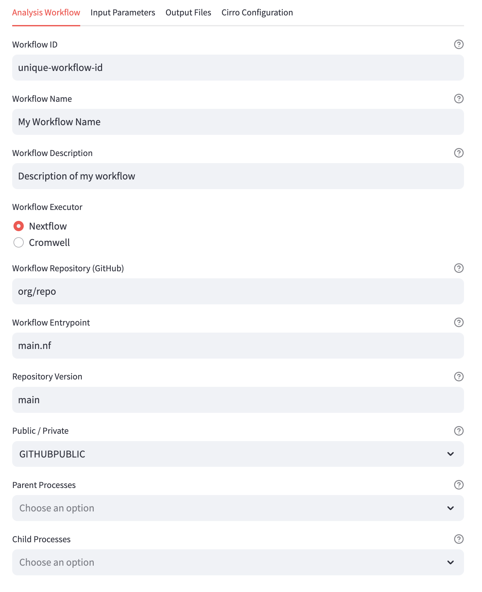

# Cirro - Workflow Configuration

In order for analysis pipelines to be run in Cirro, they must be configured
to collect needed information from the user.
That configuration is defined by a small set of files:

- `process-dynamo.json`
- `process-form.json`
- `process-input.json`
- `process-output.json`
- `preprocess.py`

While these files can be constructed manually, it is also possible to build
them using the app provided in this repository.

[Launch: Cirro - Workflow Configuration](https://cirro-configure-workflow.streamlit.app/)



### Using the Cirro - Workflow Configuration app

More extensive details on the meaning of different terms in the Cirro Workflow
Configuration app can be found in the
[Cirro Documentation](https://docs.cirro.bio).

After filling out the forms provided on the app, the configuration files
for the workflow can be accessed by either:

- Downloading the bundle of files as a ZIP archive from the
"Download all (ZIP)" button, or
- Downloading an individual file from the "Cirro Configuration" tab.

That set of configuration files can then be added to a GitHub repository
and imported into your Cirro account as a custom pipeline.

### Developers Guide

To make changes to this app, first set up a Python virtual environment
and install the requirements found in `requirements.txt`:

```
python3 -m venv .venv
source .venv/bin/activate
python3 -m pip install -r requirements.txt
```

To launch the app in an editable state, launch Streamlit from
the base directory of the repository:

```
streamlit run app.py
```

Any changes made to `app.py` can be applied to the running version of
the app, just make sure to click the button which appears in the
top-right corner of the window:


### FAQs

#### Transport Already Connected

Q: I'm seeing an error message which says
"gql.transport.exceptions.TransportAlreadyConnected", what do I do?

A: This seems to happen when user inputs are made in rapid succession.
Simply refresh the page when you see this error.

#### What is the "@session_cache"?

In order to preserve user information privately within their browser
session, the Streamlit session cache is used via the custom
`@session_cache` decorator.

The only point worth noting about this caching mechanism is that any
changes made to the code within those decorated functions will not
be applied via the live "Source file changed. Rerun" ability of
Streamlit.

Therefore, to see the effect of any changes which are made to functions
with the `@session_cache` decorator, you will need to refresh the page.
